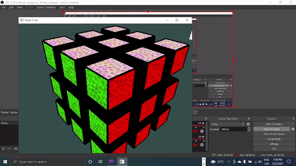

# Proyecto Final Cubo de Rubik en OpenGL  
  
# Introducción  
El proyecto final del curso Computación Gráfica consiste en el modelado, renderización y animación de un cubo de Rubik utilizando la librería OpenGL.  
# Integrantes  
Saul Andersson Rojas Coila - [Github](https://github.com/politeperson)  
# Requisitos  
El proyecto final necesita de una versión de CMAKE mayor o igual a 3.20. El proyecto también depende de las librerías:  
* [GLFW](https://www.glfw.org/)
* [GLAD](https://github.com/Dav1dde/glad)
* [GLM](https://github.com/g-truc/glm)
* [FREEIMAGE](https://freeimage.sourceforge.io/)
* [FREEGLUT](http://freeglut.sourceforge.net/)
* [GLEW](http://glew.sourceforge.net/)

# Solver  
Utilicé el siguiente solver para integrarlo en el cubo: [Solver Github](https://github.com/Rubenmp/Rubik).  

# Demo  
La demo del proyecto la encuentra en el siguiente vídeo en Youtube: [DEMO](https://youtu.be/FtdWNMhsoZY).  

# Instrucciones  
Las instrucciones de uso para el cubo las encuentra en el informe ```Informe Final del Cubo de Rubik.pdf```, también encontrará la presentación del proyecto en el siguiente link: [presentación final](https://docs.google.com/presentation/d/1ZYjr9IhYJBS5vcS_1IFZhA7BbG7lQoe22DaExhkB0k4/edit?usp=sharing).